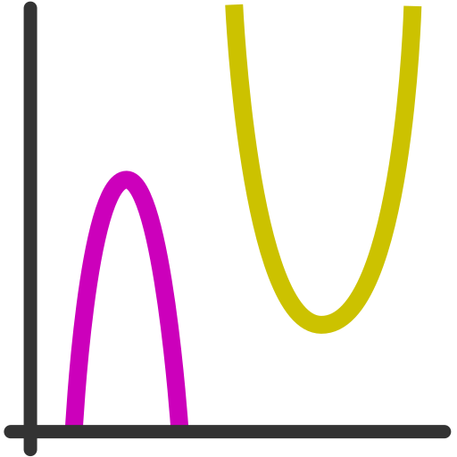
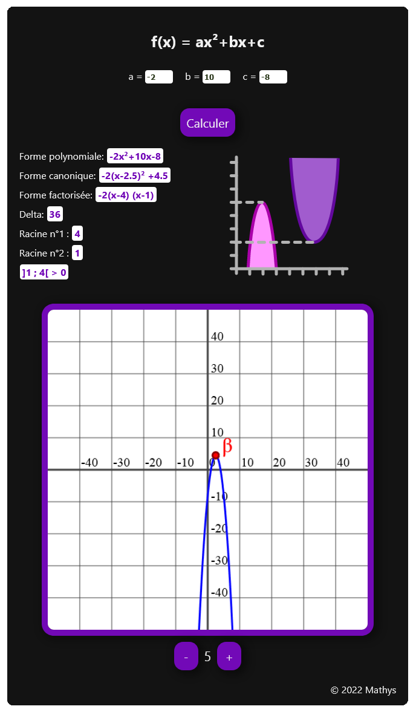
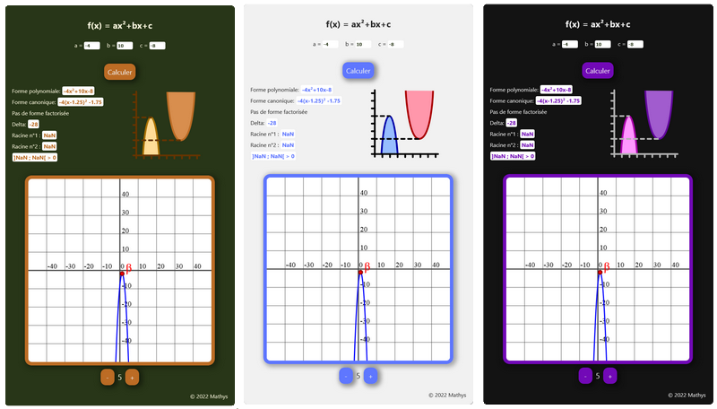

 

    
    <h2> Polynomial converter </h2>
    <small>&copy; 2022 Mathys</small>

 

***

<h3>Language</h3>

  <ol>
    <li>
      <a href="#english">English</a>
      <ul>
        <li><a href="#about">About</a></li>
        <li><a href="#graph">Graph exemple</a></li>
        <li><a href="#colors">Color themes</a></li>
      </ul>
    </li>
    <li>
      <a href="#francais">Français</a>
      <ul>
        <li><a href="#a-propos">A propos</a></li>
        <li><a href="#graphique">Exemple de graphique </a></li>
        <li><a href="#themes">Thèmes</a></li>
      </ul>
    </li>
  </ol>
 

***

 

<h1 id="english">English</h1>

<h2 id="about"> About</h2>
Polynomial-converter is a website make for student who are fed up to convert yourself quadratics polynimomials to canonical or factorised form.

 

<h2 id="graph"> Graph exemple </h2>
We can see in the screenshot                           below the interface in darkmode with an exemple function : f(x) = -2x²+10x-8

 

<h2 id="colors">Color themes</h2>
There are three color themes available with each other his own differents colors (Original, Business & Darkmode) :

 It's possible to change it with the menu button (see below) located in the left top corner.

  
Display menu

  

 

*** 

 

<h1 id="francais">Français</h1>

<h2 id="a-propos">A propos</h2>
Polynomial-converter est un site intialement destiné au passage des fonction polynomiales du second-degrée en forme canonique ou factorisée. 

 

L'objectif est de permettre une auto-correction au élève et à leur facilité une partie du travail lorsque celui-ci est particulièrement laborieux.

 

<h2 id="graphique"> Exemple de graphique </h2>
Voici un screenshot du site en darkmode avec la fonction f(x) = -2x²+10-8 comme exemple.

Dans une première partie, les résultats sont affichés : les différentes formes, delta, les racines puis l'intervalle sur laquelle la fonction est du signe contraire de a.

 

Dans une seconde partie, la courbe de la fonction est affichée ainsi que son extremum (bêta). Il est possible de dézoomer ou de zoomer le graphique jusqu'à 20 fois.

 

<h2 id="themes">Thèmes</h2>
Il existe trois thèmes disponibles avec chacuns leurs couleurs différentes (Original, Buisness & Darkmode) :

 Il est possible de le changer en utilisant le menu (voir ci-dessous) situé en haut à gauche de l'écran.

  
Afficher le menu

  

